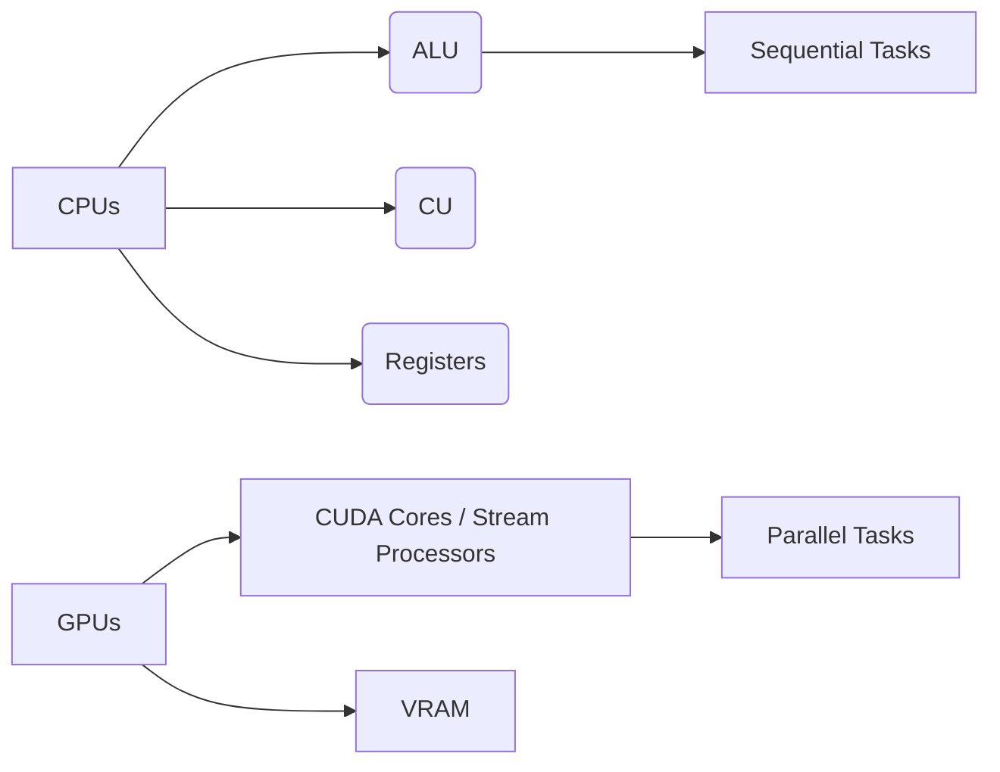
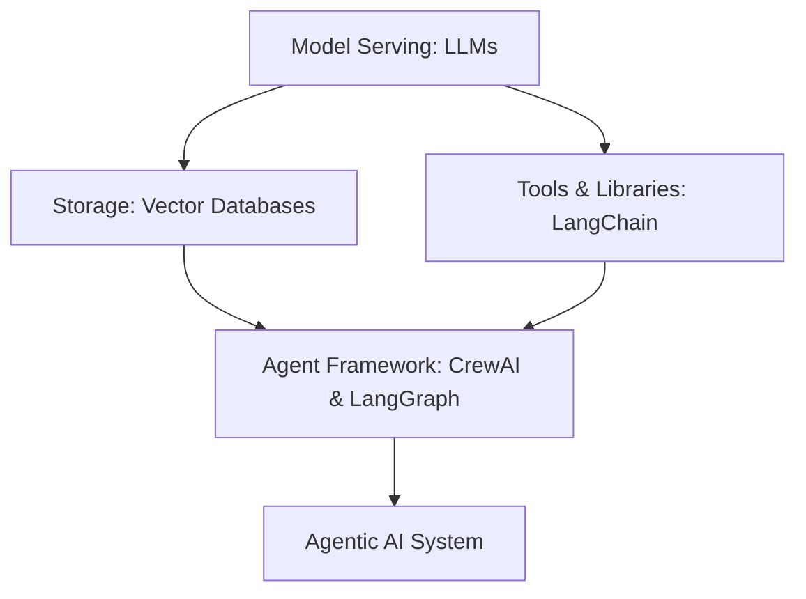
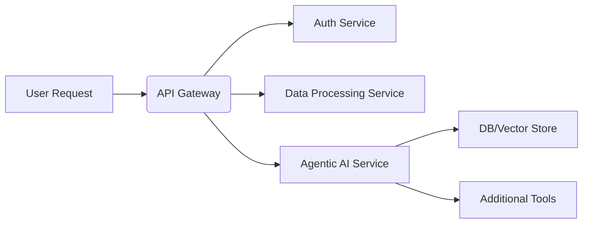

# PIAIC 4th CLASS Q2 Batch 61 (Karachi) Notes By Wajahat Hussain🚀

## INSTRUCTOR: Wajahat Hussain

## Table of Contents    
- [Detailed Notes](#detailed-notes-pencil)  
   - [1. Introduction to Agentic AI & Class Overview](#1-introduction-to-agentic-ai--class-overview)  
   - [2. CPUs vs. GPUs](#2-cpus-vs-gpus)  
   - [3. NVIDIA CUDA: Parallel Computing Architecture](#3-nvidia-cuda-parallel-computing-architecture)  
   - [4. Neural Network Fundamentals](#4-neural-network-fundamentals)  
   - [5. Path to AGI (Artificial General Intelligence)](#5-path-to-agi-artificial-general-intelligence)  
   - [6. Compound AI Systems](#6-compound-ai-systems)  
   - [7. Agentic AI Stack Overview](#7-agentic-ai-stack-overview)  
   - [8. The Next Wave of AI: Humanoids, Cloud, Edge & Link Computing](#8-the-next-wave-of-ai-humanoids-cloud-edge--link-computing)  
   - [9. Microservices AI Agents & Architecture](#9-microservices-ai-agents--architecture)
   - [10. LangChain And LangGraph](###-10.-LangChain-&-LangGraph) 
- [Conclusion](#conclusion-star2)
-  [Summary](#summary-clipboard)


### 1. Introduction to Agentic AI & Class Overview

1. **Hello World via Google Gemini**  
   - Showed how to run a basic “Hello World” program using **Google Gemini 2.0 Live API**.  
   - Demonstration of interacting with **Large Language Models (LLMs)** through APIs.

2. **Technology Background for AI**  
   - Focus on **Agentic AI**, which involves autonomous systems acting on their own.  
   - Reference repo: [Panaversity Learn-Agentic-AI](https://github.com/panaversity/learn-agentic-ai/tree/main/01_technology_background/01_what_is_a_gpu).


### 2. CPUs vs. GPUs

#### 2.1 CPU (Central Processing Unit)

- **Sequential Processing**: Handles one instruction at a time.  
- **CPU Components**:
  - **ALU (Arithmetic Logic Unit)**: Performs arithmetic and logical operations.  
  - **CU (Control Unit)**: Orchestrates and manages instruction flow.  
  - **Registers**: Small, high-speed storage for temporary data.  

#### 2.2 GPU (Graphics Processing Unit)

- **Parallel Processing**: Executes many tasks **simultaneously**.  
- **History & Development**: 
  - **NVIDIA** pioneered GPU tech for graphics, later extended to general computing.  
  - **AMD** is another major player in parallel computing.  
- **GPU Components**:
  - **CUDA Cores (NVIDIA)** / **Stream Processors (AMD)** for parallel execution.  
  - **VRAM (Video RAM)**: High-speed memory specialized for handling graphical/AI data.

> **Flowchart**: CPU vs. GPU Architecture




### 3. NVIDIA CUDA: Parallel Computing Architecture

- **Definition**  
  - **CUDA** = Compute Unified Device Architecture, enabling **general-purpose GPU computing**.

- **Key Features**  
  1. **Parallel Processing**: Splits large problems into smaller tasks across multiple GPU cores.  
  2. **Developer Accessibility**: Extensions for C/C++/Fortran; includes core libraries like **cuBLAS**, **cuDNN**, **TensorRT**.  
  3. **Extensive Ecosystem**: Widely used in AI, HPC, and scientific research.

- **Importance for AI**:  
  - **Scalability** — GPUs can train and run large neural networks faster.

- **NVIDIA Blackwell GPUs**:  
  - Future/next-gen architectures offering improved **speed**, **memory bandwidth**, and **AI features**.

- **Semiconductor Fabrication**:  
  - **TSMC** (Taiwan Semiconductor Manufacturing Company) fabricates chips for **NVIDIA**, **AMD**, and others.


### 4. Neural Network Fundamentals

- **Basic Equation**: \(\,y = w\,x + b\)  
  - \(x\) = Input  
  - \(w\) = Weights  
  - \(b\) = Bias  
  - \(y\) = Output (Prediction)  

> This underpins neural network computations; stacking many layers of this equation forms **deep learning**.


### 5. Path to AGI (Artificial General Intelligence)

| **Step**        | **Description**                                                                                               |
|-----------------|---------------------------------------------------------------------------------------------------------------|
| **Chatbots**    | Basic Q&A systems using LLMs.                                                                                 |
| **Reasoners**   | Systems with **logical** capabilities (chain-of-thought reasoning).                                           |
| **Agents**      | **Autonomous** entities capable of tool usage and external interaction.                                       |
| **Innovators**  | AI that can **create new ideas** and solutions.                                                               |
| **Organizations** | AI-driven companies or institutions with **minimal human** involvement.                                     |


### 6. Compound AI Systems

- **Definition**  
  - Systems that combine **multiple specialized components** (models, databases, tools) rather than relying on a single model.

- **Advantages**  
  1. **Dynamic & Flexible**: Adapt to various tasks and environments.  
  2. **Enhanced Control & Trust**: Modular design allows better verification and formatting of outputs.  
  3. **Improved Performance**: Specialized models each excel in certain tasks, collectively boosting performance.

> Agentic AI systems are inherently **compound** — orchestrating many tools for complex tasks.


### 7. Agentic AI Stack Overview

| **Layer**              | **Function**                                                                                             | **Examples**                                            |
|------------------------|---------------------------------------------------------------------------------------------------------|---------------------------------------------------------|
| **Model Serving**      | **LLMs** process/generate text (core AI “brain”)                                                        | OpenAI, Anthropic                                       |
| **Storage**            | Store/retrieve conversation history & embeddings                                                       | Chroma, Weaviate, Pinecone                              |
| **Tools & Libraries**  | Extend functionality beyond text (e.g., code execution, web access)                                     | LangChain, custom APIs                                  |
| **Agent Frameworks**   | Orchestrate multi-step tasks, manage state, tool usage, interactions                                   | CrewAI, LangGraph                                       |

**CrewAI** and **LangGraph** are frameworks that streamline building and running agents:
- **CrewAI**: Coordinates multiple agents with specialized roles.  
- **LangGraph**: A **graph-based** approach managing state, context, and workflow.

> **Flowchart**: Agentic AI Stack



### 8. The Next Wave of AI: Humanoids, Cloud, Edge & Link Computing

1. **Humanoid Robotics**  
   - AI + Robotics = Machines with **human-like** structures and capabilities.

2. **Cloud Computing**  
   - Offloads **heavy computing** to remote servers (AWS, Azure, GCP).

3. **Edge Computing**  
   - Processes data on **local devices** (IoT, smartphones) for reduced latency.  
   - Example: **Self-driving cars** do real-time inference on-board.

4. **Link Computing**  
   - Distributed approach connecting **cloud, edge, and local** compute resources.


### 9. Microservices AI Agents & Architecture

- **Monolithic Architecture**  
  - Everything in **one large application**; harder to scale and update.

- **Microservices Architecture**  
  - Breaks the system into **small, independent services** communicating via APIs.  
  - **Docker** containers isolate each service for easier deployment and maintenance.

> **Table**: Monolithic vs. Microservices

| **Architecture**      | **Pros**                                     | **Cons**                                    |
|-----------------------|----------------------------------------------|---------------------------------------------|
| **Monolithic**        | Simpler to develop initially                 | Difficult to scale, deploy, and maintain    |
| **Microservices**     | Highly scalable, fault isolation, flexible   | More complex to orchestrate and set up      |

- **AI Use Case**  
  - Each microservice handles a **dedicated AI function** (e.g., data ingestion, authentication, listing).  
  - The agent orchestrates tasks across these services.




## Conclusion :star2:

Agentic AI combines:
1. **GPU Parallelism**: (NVIDIA CUDA, AMD Stream Processors) to accelerate large tasks.  
2. **Compound AI Systems**: Multiple specialized components orchestrated for **superior performance**.  
3. **Agent Frameworks**: (CrewAI, LangGraph) to manage AI tools and states efficiently.  
4. **Microservices**: Scalable, modular architecture for **production-grade** AI solutions.

As technology advances (e.g., **NVIDIA Blackwell** GPUs, humanoid robots, more mature microservices), understanding these foundational pieces will help you build **state-of-the-art** AI applications. Good luck on your journey in **Agentic AI**!  

### 10. LangChain & LangGraph

#### **What is LangChain?**

- **LangChain** is an **LLM-based framework** used for building applications that harness the power of Large Language Models in a structured, **production-friendly** way.  
- **Core Idea**: Instead of writing monolithic code that makes one direct API call, LangChain helps you:
  1. **Chain** together various prompts, tools, and memory.  
  2. **Manage Context**: Keep track of conversation history (stateful chat).  
  3. **Orchestrate Tools**: Integrate with **external APIs**, data stores, and other components easily.

**Why Use LangChain?**
- **Modularity**: You can swap out one LLM or vector database for another.  
- **Ease of Use**: Pre-built classes and utilities for text generation, memory, prompt templates, and tool usage.  
- **Community & Ecosystem**: Active open-source community, constant updates, and rich documentation.

#### **What is LangGraph?**

- **LangGraph** is a **graph-based** framework for designing flows and orchestration around LLMs.  
  - Think of it as a **visual or structural approach** to connecting various components in an AI agent (prompt templates, tool calls, database lookups) through a **graph** of nodes and edges.
- **Key Benefits**:
  1. **Clear Visualization**: You can “see” the path your AI agent takes.  
  2. **State Management**: Each node can manage state, inputs, and outputs.  
  3. **Flexible Integrations**: Similar to LangChain but with a **graph-oriented** perspective for more complex workflows.

#### **Hello World with LangChain**

Below is an example of installing and initializing a **Google Gemini** model via **LangChain**:

```python
!pip install -Uq langchain langchain-google-genai

from langchain_google_genai import ChatGoogleGenerativeAI
from google.colab import userdata

# Retrieving API Key securely
GOOGLE_API_KEY = userdata.get('GOOGLE_API_KEY')

# Initializing the Gemini 2.0 model
llm: ChatGoogleGenerativeAI = ChatGoogleGenerativeAI(
    model="gemini-2.0-flash-exp",
    api_key=GOOGLE_API_KEY,
)

# Simple Hello World Prompt
response = llm("Hello, world!")
print(response)
```

Explanation:
1. **Installation**: `!pip install langchain langchain-google-genai` installs LangChain and the Google Generative AI module.  
2. **Imports**: We import `ChatGoogleGenerativeAI` from the `langchain_google_genai` package and `userdata` from `google.colab` to access user-specific environment variables (like `GOOGLE_API_KEY`).  
3. **Model Initialization**: `ChatGoogleGenerativeAI` is set to use `"gemini-2.0-flash-exp"`, a cutting-edge version of the **Google Gemini** LLM.  
4. **Sending a Prompt**: We simply provide `"Hello, world!"` as input and print the LLM’s response.

> **Why Gemini?** Google’s Gemini models are next-gen LLMs providing high-quality, efficient responses across various tasks.  


## Summary :clipboard:

| **Key Point**          | **Description**                                                                                                                |
|:-----------------------|:-------------------------------------------------------------------------------------------------------------------------------|
| **CPUs vs. GPUs**      | CPUs work **sequentially**, GPUs work **in parallel**, making GPUs ideal for **AI**.                                          |
| **NVIDIA CUDA**        | A **parallel computing platform** for general-purpose GPU computing (e.g., **cuBLAS**, **cuDNN**).                            |
| **Agentic AI**         | AI systems that act **autonomously**, leveraging **Compound AI** designs for complex tasks.                                    |
| **Compound AI Systems**| Combine **multiple specialized models** and tools to handle diverse tasks with **higher performance** and **trustworthiness**.|
| **Microservices**      | **Small, independent services** communicating via **APIs**, enabling easier **scaling** and **maintenance**.                  |


> **Tip**:  
> - Explore **CUDA libraries** (cuBLAS, cuDNN, TensorRT) for GPU acceleration.  
> - Practice with **CrewAI** or **LangGraph** for multi-agent development.  
> - Use **Docker** to containerize microservices for real-world scalability.  

---  

_**Happy Learning!**_ 
